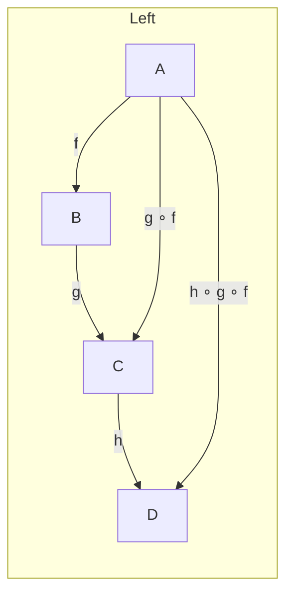
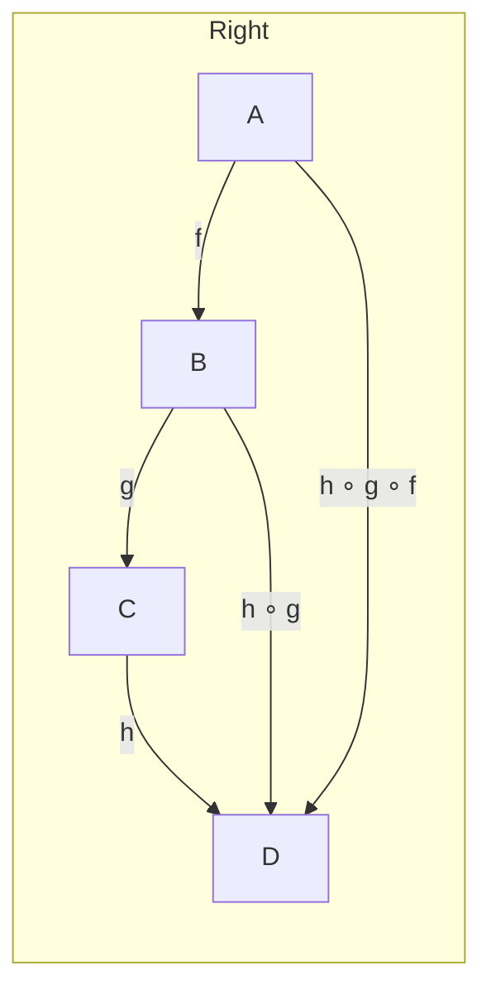
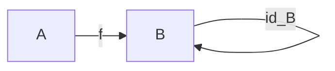
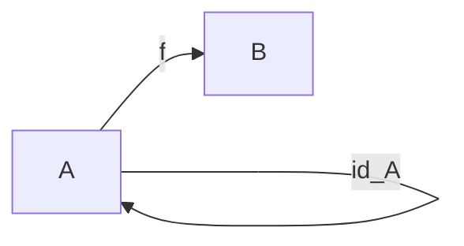

# 圏論学習ノート (C#)

## 圏論 (Category Theory) とは

圏論は、数学の抽象的な構造を統一的に扱うための理論です。オブジェクト指向プログラミングの「オブジェクト」と「メッセージ」という概念は、圏論の「対象 (Objects)」と「射 (Morphisms)」に対応しており、プログラミングの観点から圏論を理解することができます。

### 圏論における3つの重要な概念

圏論の基礎となる3つの概念—**Abstraction（抽象化）**、**Composition（合成）**、**Identity（同一性）**—を理解することは、プログラミングにおけるコード設計の本質を理解することにつながります。

---

## 1. Abstraction（抽象化）

### 圏論における定義

圏論では、**具体的な詳細を隠し、本質的な構造だけを扱う**ことが抽象化の考え方です。

圏論では以下の要素で構成されます：

- **対象 (Objects)**: 実体そのもの（集合、グループ、トポロジー空間など）
- **射 (Morphisms / Arrows)**: 対象と対象の間の関係性（関数、準同型写像など）

重要なのは、**対象の内部構造は気にせず、他の対象との関係性だけに注目する**ということです。

オブジェクトの内部の詳細を議論しないという態度は、プログラミングにおける `interface` を考えることに対応します。具体実装を隠して外部に対する振る舞い（関係）だけを見ることは、抽象化を考える第一歩です。

### 射 (Morphisms / Arrows)

射は、対象と対象の間に描かれる矢印で、通常は `f`, `g`, `h` などの記号で表されます。矢印の端にあるものが対象（始点と終点）であり、射は「点と点を結ぶ」プリミティブな関係を表します。圏論ではこの射が基本的な構成要素であり、射の合成や恒等射といった性質を通して対象同士の関係を扱います。

例えば、オブジェクト A からオブジェクト B への射を `f: A -> B` と書きます。ここで A と B は「点」であり、`f` はそれらを結ぶ矢印です。

### 合成 (Composition)

オブジェクト `A`, `B`, `C` があり、射 `f: A -> B` と `g: B -> C` が存在するとします。このとき、`A` から `C` への射は射の合成として定義され、通常は `g ∘ f`（あるいは `g・f`, “g after f”）と書きます。合成の射は `g ∘ f : A -> C` で、まず `f` によって `A` から `B` へ移し、その結果に `g` を適用する操作として理解できます。

合成は以下の性質を満たします。
- **結合律 (Associativity)**: 任意の射 `f, g, h` に対して `(h ∘ g) ∘ f = h ∘ (g ∘ f)` が成り立ちます。
- **恒等射 (Identity)**: 各対象 `X` には恒等射 `id_X: X -> X` が存在し、任意の射 `f: A -> B` に対して `id_B ∘ f = f = f ∘ id_A` が成り立ちます。これによって、始点と終点に対する射の振る舞いを一貫して扱えます。

 ここで、`id_B ∘ f = f` は `id_B` が射 `f` に対する**左恒等 (left identity)** であることを意味し、`f ∘ id_A = f` は `id_A` が射 `f` に対する**右恒等 (right identity)** であることを表します。言い換えると、対象の終点に対応する恒等射はその終点へ合成したときに何も変えず、始点に対応する恒等射は合成の右側に置いても何も変えない、という性質です。

### [WIP]モノイド (Monoid)

モノイドは、集合 `M` と二項演算 `• : M × M -> M`、および単位元 `e ∈ M` を持つ代数的構造で、次を満たします。
- **結合律**: 任意の `a, b, c ∈ M` に対して `(a • b) • c = a • (b • c)`。
- **単位元**: 任意の `a ∈ M` に対して `e • a = a = a • e`。

圏論の観点では、モノイドは**単一対象の圏**と見なせます。単一対象 `*` を持つ圏において、`End(*)`（`*` から `*` へのすべての射）の集合がモノイドを成し、射の合成がモノイドの二項演算、恒等射 `id_*` が単位元に対応します。言い換えれば、モノイドの要素はその圏の自己射（endomorphisms）であり、モノイドの演算は射の合成です。

例:
- 整数全体と加法 `(ℤ, +, 0)` はモノイド（実は群）です。
- 文字列の連結 `(Strings, concat, "")` もモノイドの例です。

簡単な C# 的イメージ:

```csharp
// 文字列モノイドのイメージ
static string Combine(string a, string b) => a + b; // 結合（結合律を満たす）
static string Empty => string.Empty; // 単位元
```

モノイドの概念は、プログラミングでの「可合成な操作」や「初期値/単位元」を扱う場面でよく現れます。

### 可視化 (Visualization)

以下のMermaid図は、射の合成に関する**結合律 (Associativity)** と **恒等射 (Identity)** を視覚的に示します。

#### 結合律の例

左結合 `(h ∘ g) ∘ f` と右結合 `h ∘ (g ∘ f)` の両方は最終的に `A -> D` への合成になります。順序の違いを示すために、同じ合成を2つの図で示します。





どちらの順で合成しても最終的に `A -> D` となり、結果は等しい（結合律）。

#### 恒等射の例

恒等射は合成に対して何も変えないことを示します。





これらの図は、恒等射が合成の前後で射 `f` を変化させないことを視覚的に示しています。

### プログラミングでの類似概念

プログラミングでは、圏の対象はしばしば「型（types）」に対応し、射は「関数（functions）」やメソッドに対応します。関数の型シグネチャは射の表記と同じく `f: A -> B` で表され、引数の型 `A` を受け取り戻り値の型 `B` を返すことを意味します。C# では `B f(A x)` や `Func<A,B>` のように表現します。例えば: `static int Increment(int x) => x + 1; // Increment: int -> int`

