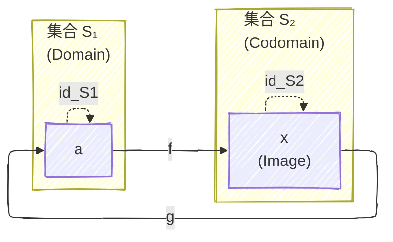
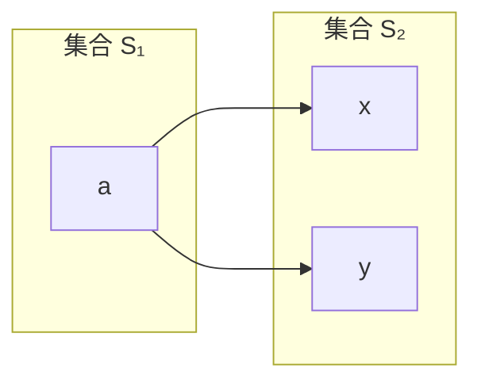

# 圏論学習ノート (C#)

## 関数 (Functions) と 射 (Morphisms)

参考動画: [Category Theory for Programmers 2.1: Functions, epimorphisms](https://www.youtube.com/watch?v=O2lZkr-aAqk&t=33s)

圏論における「射 (Morphism)」は、集合の圏 (Set) においては「関数 (Function)」として理解できます。
しかし、プログラミングにおける関数と、数学（圏論）における関数には重要な違いがあります。圏論として扱うためには、以下の性質を理解する必要があります。

### 1. 純粋関数 (Pure Functions)

数学的な関数は、入力と出力の関係のみを表します。

-   **同じ入力には常に同じ出力を返す (Deterministic)**
-   **副作用 (Side Effects) がない**: 外部の状態を変えたり、外部の状態に依存したりしない。

C# のような言語では、`static` メソッドであってもグローバルな状態にアクセスすれば純粋ではありません。

### 2. 全域関数 (Total Functions)

数学的な関数は、定義域 (Domain) の**すべての**要素に対して値が定義されていなければなりません。これを **全域関数 (Total Function)** と呼びます。

対して、一部の入力に対して値が定義されない（例外を投げる、無限ループするなど）関数を **部分関数 (Partial Function)** と呼びます。

#### 部分関数の例
```csharp
// 0 で割ると例外が発生するため、int 全体に対して定義されていない
int Divide(int a, int b) => a / b;
```

#### 全域関数への変換
部分関数を全域関数として扱うための一般的なアプローチは2つあります。

1.  **定義域を制限する**: ゼロを含まない型 `NonZeroInt` を定義し、それを引数にする。
2.  **値域を拡張する**: 戻り値を `int` ではなく、失敗の可能性を含む型（`int?` や `Option<int>`）にする。

---

## 実装デモ: FunctionsDemo

純粋関数・全域関数の概念を確認するための xUnit テストプロジェクトです。

### プロジェクト構成

-   `FunctionTests.cs`: 以下のテストを含みます。
    -   `Pure_vs_Impure`: 純粋関数と非純粋関数の挙動の違い。
    -   `Partial_vs_Total`: 部分関数（例外発生）と、それを全域関数化した例。

### コード例

#### 純粋関数 (Pure)
```csharp
public static int Add(int a, int b) => a + b;
```

#### 全域関数化 (Total)
```csharp
public static int? SafeDivide(int a, int b)
{
    if (b == 0) return null; // 値域を拡張して全域で定義する
    return a / b;
}
```

---

## WIP補足: 関係 (Relation) と関数の厳密な定義

- **関係 (Relation)**: 2 つの集合の要素同士の関係は、直積 (Cartesian product) の部分集合として定義できます。
    つまり、関係 R は $S_1\times S_2$ の部分集合で、要素はペア $(a,b)$ です。
- **直積 (Cartesian product)**: $S_1\times S_2=\{(a,b)\mid a\in S_1,\;b\in S_2\}$。
- **関数 (Function)**: 関係のうち、各入力 $a\in S_1$ に対して対応する出力が「高々1つ」だけ存在するものを関数と呼びます（これが関数の functional property）。
    - もしある $a$ に複数の $b\in S_2$ が対応するなら、それは関数ではありません（単なる関係です）。
        ```mermaid
        ---
        config:
        layout: elk
        look: handDrawn
        ---
        graph LR
            subgraph S1["集合 S₁"]
                a1["a"]
            end
            subgraph S2["集合 S₂"]
                x1["x"]
                y1["y"]
            end
            a1 --> x1
            a1 --> y1
        ```
- **全域関数 (Total function)**: さらに各 $a\in S_1$ にちょうど1つの像が存在する場合を全域関数と呼びます（定義域のすべてに定義される）。
    - これに対して、ある入力に像が存在しないことを許すと部分関数 (Partial function) になります。
- **Domain / Codomain / Image**:
    - Domain: 出発集合（例: $S_1$）。
    - Codomain: 目標集合（例: $S_2$）。
    - Image (像): 実際に現れる値の集合 $\mathrm{Im}(f)=\{f(a)\mid a\in S_1\}\subseteq S_2$。
- **逆写像と合成**:
    - $f:A\to B$ に対して $g:B\to A$ が逆写像であるためには、両方の合成が恒等写像になる必要があります:
        $g\circ f=\mathrm{id}_A$ かつ $f\circ g=\mathrm{id}_B$。
    - 片側だけ成り立つ場合は左逆（$g\circ f=\mathrm{id}_A$）や右逆（$f\circ g=\mathrm{id}_B$）と呼び、左逆があると injective、右逆があると surjective になります。
- **同型 (Isomorphism)**: 集合圏では、逆写像が存在する（双方向の合成が恒等写像になる）写像は双射（bijection）であり、同型と呼ばれます。

上の違い（関係 ⇄ 関数、部分関数 ⇄ 全域関数、逆写像の片側だけの性質）は圏論やプログラミングで扱う際に重要な直感と厳密性を与えます。

### 関数の可視化例

以下の図は、関数 $f: S_1 \to S_2$ が関係（点と矢印）としてどのように機能するかを示しています。



**図の説明:**
- **S₁**: Domain（定義域）。要素 aを含む集合。関数fの定義域であり、関数gの余域でもある。
- **S₂**: Codomain（余域）。要素 x を含む集合。関数fの余域であり、関数gの定義域でもある。
- **実線矢印**: 関数 $f$ による対応。各 $a \in S_1$ は高々1つの像 $f(a) \in S_2$ を持つ（functional property）。矢印の先端がImage要素に到達していることに注目。
- **実線矢印**: 関数 $g$ による対応。各 $x \in S_2$ は高々1つの像 $g(x) \in S_1$ を持つ（functional property）。矢印の先端がImage要素に到達していることに注目。
- **点線矢印**: 恒等写像 $\mathrm{id}$。各要素が自分自身に対応する射。

🔴 なぜ一般に inverse（逆写像）は存在しないのか

関数𝑓:𝑆1→𝑆2が invertible（可逆） になるには、

∃𝑔:𝑆2→𝑆1s.t.𝑔∘𝑓=𝑖𝑑𝑆1 and𝑓∘𝑔=𝑖𝑑𝑆2
が必要である。
しかし一般には成立しない。

① collapse が起きる場合（非単射）
● 定義

異なる要素が同じ値に写る：

𝑥1≠𝑥2だが𝑓(𝑥1)=𝑓(𝑥2)

このとき情報が潰れている。

例：isEven
𝑖𝑠𝐸𝑣𝑒𝑛:𝑍→{𝑡𝑟𝑢𝑒,𝑓𝑎𝑙𝑠𝑒}
- 2 → true
- 4 → true
- 6 → true

複数の整数が同じ値に写る。

→ どの整数だったか復元できない。

したがって逆写像は存在しない。

● これが起きない条件
injective（単射）
𝑓(𝑥1)=𝑓(𝑥2)⇒𝑥1=𝑥2
同じ像なら元も同じ。

これを injection と呼ぶ。

② 像が codomain を覆わない場合（非全射）
● 状況
Im(𝑓)⊊𝑆2

S₂ に「到達しない要素」がある。

問題

逆写像

𝑔:𝑆2→𝑆1

を定義しようとしても、

𝑦∈𝑆2∖Im(𝑓)
に対して

𝑔(𝑦)
を定義できない。

なぜなら、

「その y を生成した元が存在しない」から。

● これが起きない条件
surjective（全射）
∀𝑦∈𝑆2,∃𝑥∈𝑆1 s.t.𝑓(𝑥)=𝑦

つまり

Im(𝑓)=𝑆2

これを surjection と呼ぶ。

③ 可逆になる条件

関数が invertible になるのは：

injective

surjective

両方を満たすとき。

これを

bijective


（全単射）という。


✏️ コラム：fibre（ファイバー）

関数

𝑓:𝑆1→𝑆2
​


に対して、

ある𝑦∈𝑆2 の fibre は：

𝑓−1(𝑦)={𝑥∈𝑆1∣𝑓(𝑥)=𝑦

つまり

「y に写る元の集合」

collapse の正体

injective でないとは：

∣𝑓−1(𝑦)∣>1

となる y が存在すること。

つまり：

ファイバーが複数要素を持つ

ことが collapse。

surjective でないとは

ある y について

𝑓−1(𝑦)=∅

つまり：

空ファイバーが存在する

🧩 fibration（発展話）

圏論や幾何では：

各点の上に fibre がぶら下がっている

空間が「層構造」になっている

という見方をする。

特に：

𝑝: 𝐸→𝐵

の形で、

B の各点 b に fibre 𝑝−1(𝑏) がある。

これを fibration と呼ぶ。

直感的には：

「空間を点ごとに束ねた構造」

ベクトル束やトポロジーで重要。

🔵 まとめ（ノート用）

逆写像が存在しない理由は二つ：

collapse（非単射）

未到達（非全射）

可逆であるためには：

injective
+
surjective
=
bijective


ファイバーの観点から見ると：

collapse = fibre が複数要素

非全射 = 空 fibre が存在

*
圏論では
単射な関数に対するものはmonie, monomorphism
全射な関数に対するものはepic, epimorphism
WIP


# 圏の定義

圏（category）とは、4つ組

$$
\mathcal{C} = (O, A, \circ, \mathrm{id})
$$

からなる構造である。

---

## 1. 対象（Objects）

- $O$ は対象（objects）の集まり。
- 元を $X, Y, Z, W \in O$ と書く。

---

## 2. 射（Morphisms / Arrows）

各対象 $X, Y \in O$ に対して、

$$
A(X,Y)
$$

を対象 $X$ から対象 $Y$ への射の集まりとする。

射 $f \in A(X,Y)$ を

- $f : X \to Y$
- $X \xrightarrow{f} Y$

と書く。

すべての射をまとめて $A$ と書く。

---

## 3. 射の合成（Composition）

任意の $X, Y, Z \in O$ に対して写像

$$
\circ_{X,Y,Z} :
A(Y,Z) \times A(X,Y)
\to
A(X,Z)
$$

が定まっている。

これは

$$
X \xrightarrow{f} Y
\quad
Y \xrightarrow{g} Z
$$

を受け取り、

$$
g \circ_{X,Y,Z}  f : X \to Z
$$

を与える。

以下では
$$
g \circ_{X,Y,Z}
$$
添字X,Y,Zを省略して $\circ$ と書く。

---

## 4. 恒等射（Identity）

各対象 $X \in O$ に対して、

$$
\mathrm{id}_X : X \to X
$$

が定まっている。

---

## 5. 公理

### 結合律（Associativity）

任意の

$$
X \xrightarrow{f} Y
\quad
Y \xrightarrow{g} Z
\quad
Z \xrightarrow{h} W
$$

に対して、

$$
h \circ (g \circ f)
=
(h \circ g) \circ f
$$

が成り立つ。

---

### 単位律（Unit Law）

任意の $f : X \to Y$ に対して、

$$
\mathrm{id}_Y \circ f
=
f
=
f \circ \mathrm{id}_X
$$

が成り立つ。


## プログラミング言語の意味論

プログラムの意味を数学的な言葉で定義する枠組みを **プログラミング言語の意味論** と呼ぶ。
意味論のアプローチには主に二つがある：

- **操作的意味論** :
  プログラムがどのように計算を進めるか、実行規則（ステップ関係）を定義し、計算過程そのものに意味を与える。コンパイラやインタプリタの挙動を模した形で、ステートと遷移に基づく。
- **表示的意味論** (denotational semantics) :
  プログラムの構造を数学的対象に写像し、意味を与える。例えば、式を対応する関手や圏の射として扱う。計算の仕方そのものには依存せず、抽象的な性質に着目する。

プログラムの抽象的な側面に焦点を当てることで、言語に依存しない一般的な理論を得られる。

### 合成性 (Compositionality)

表示的意味論では **合成性** が重要な性質である。
プログラム $P$ と $Q$ を組み合わせて $R$ を作るとき、
$$
\llbracket R \rrbracket
$$
（Rの意味）が $\llbracket P\rrbracket$ と $\llbracket Q\rrbracket$ から構築できるとき、その意味付けは合成的である。
基本的な部品の意味を知るだけで複合プログラムの意味が導けるため、解析や証明が容易になる。

適切な圏と関手を用いると、表示的意味論を与えることができる。
関手は対象を対象に、射を射に対応させ、恒等射と合成を保存する写像であるため、構造を保ちながらプログラム構文を数学的な世界に持ち込む手段として機能し、その意味は自然に合成的になる。

#### 関手 (Functor) の定義

圏論における圏$\mathcal{C}$から圏$\mathcal{D}$への **関手** $F : \mathcal{C} \to \mathcal{D}$ は、写像$F : Ob_\mathcal{C} \to Ob_\mathcal{D}$と$F : Hom_\mathcal{C} \to Hom_\mathcal{D}$の組で次の性質を持つ：

1. 圏$\mathcal{C}$の対象Ｖ，Wに対し、$F (Hom_\mathcal{C}(V, W)) ⊂Hom_\mathcal{D}(F(V), F(W))$
2. 圏$\mathcal{C}$の射 $fU \xrightarrow{f} V \xrightarrow{g} W$ に対し、$F(g\circ f)= F(g)\circ F(f)$
3. 圏$\mathcal{C}$の対象Vに対して、$F(\mathrm{id}_V)=\mathrm{id}_{F(V)}$


表示的意味論では、構文圏から意味圏への関手が意味付けそのものに相当する。